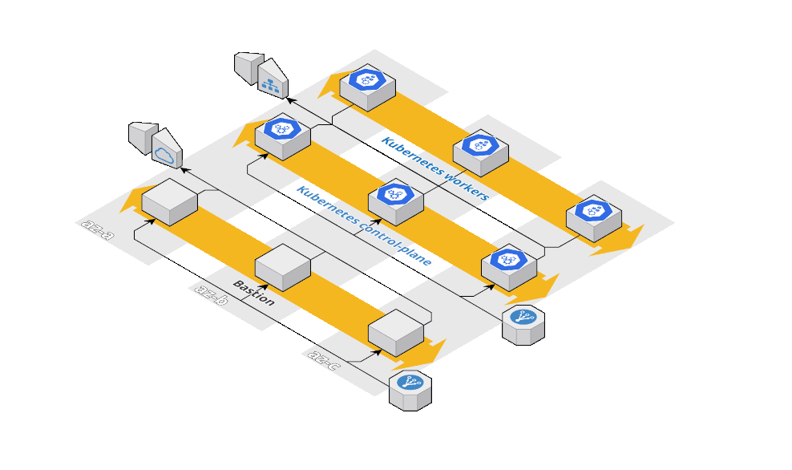

# Terraform Kubernetes

This module deploys a [Kubernetes](https://kubernetes.io/) cluster on AWS using [Kubeadm](https://kubernetes.io/docs/reference/setup-tools/kubeadm/)



## Requirements

* A DNS zone. The [kops documentation](https://github.com/kubernetes/kops/blob/master/docs/getting_started/aws.md#configure-dns) describes in details the way to do so.

## How to use the modules

This repository contains a _**bastion**_ and a _**kubernetes**_ [module](https://github.com/Smana/terraform-kubernetes/tree/main/modules).

```console
$ terraform init
$ terraform apply
```

When you apply this configuration you'll get a local **kubeconfig** in the root terraform directory.

```console
$ export KUBECONFIG=$(terraform output -json | jq -r '.kubeconfig.value')
```

From now on you can use the newly created Kubernetes cluster from your local machine (`kubectl`, `helm`)

```console
$ kubectl get nodes
NAME                                       STATUS     ROLES                  AGE     VERSION
ip-10-0-1-129.eu-west-3.compute.internal   NotReady   control-plane,master   2m31s   v1.20.1
ip-10-0-2-55.eu-west-3.compute.internal    NotReady   <none>                 58s     v1.20.1
```

## What's next

Please read the kubernetes module's [documentation](modules/kubernetes/README.md)

## License

This code is released under the Apache 2.0 License. Please see [LICENSE](https://github.com/Smana/terraform-kubernetes/tree/main/LICENSE) for more details.
