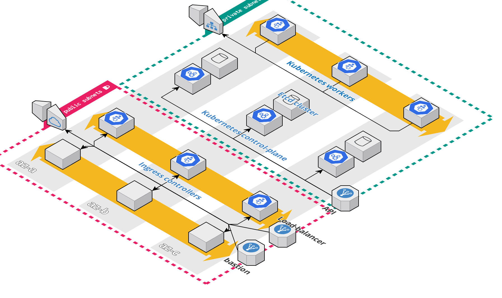

# Terraform Kubernetes module

This module deploys a [Kubernetes](https://kubernetes.io/) cluster on AWS using [Kubeadm](https://kubernetes.io/docs/reference/setup-tools/kubeadm/)



This repo has the following folder structure:

* [modules](https://github.com/Smana/terraform-kubernetes/tree/main/modules): This folder contains a 'bastion' and a 'kubernetes' module.
* [examples](https://github.com/Smana/terraform-kubernetes/tree/main/examples): TODO
* [todo test](): Automated tests for the modules and examples.
* [root folder](): The root folder is *an example* ...


### Requirements

For control-plane high-availability a DNS zone is mandatory. The [kops documentation](https://github.com/kubernetes/kops/blob/master/docs/getting_started/aws.md#configure-dns) describes in details the way to do so.
This is basically what I did:

* Creating a DNS zone and getting the nameservers
```
ID=$(uuidgen) && aws route53 create-hosted-zone --name cloud.smana.me --caller-reference $ID | jq .DelegationSet.NameServers
[
  "ns-1502.awsdns-59.org",
  "ns-608.awsdns-12.net",
  "ns-224.awsdns-28.com",
  "ns-1779.awsdns-30.co.uk"
]
```

* Then configuring my registrar to forward the requests for the domain `cloud.smana.me` to the nameservers above.

## How to use this Module


When you apply this configuration you'll get a local kubeconfig in the root terraform directory.
```
$ export KUBECONFIG=$(terraform output -json | jq -r '.kubeconfig.value')
```

From now on you can use the newly created Kubernetes cluster from your local machine (`kubectl`, `helm`)

```
$ kubectl get nodes
```

**Post-apply requirements:** 
* The cluster has been provision without `kube-proxy` that means that it is meant to be used with cilium.
* I tried to use the Helm provider but I'm not sure this is actually useful as I want to use a GitOps tool for apps deployment. Currently, I decided to run the Helm command using the CLI for the CNI plugin.
* Beware about the pod CIDR, it must be different from the subnets you use within your VPC

Here is an example of a Helm command that installs Cilium with kube-proxy replacement.
```
$ helm upgrade --install cilium cilium/cilium --version 1.9.1 --namespace kube-system \
--set kubeProxyReplacement='strict' \
--set k8sServiceHost=$(terraform output -json | jq -r '.api_dns.value'),k8sServicePort='6443' \
--set ipam.operator.clusterPoolIPv4PodCIDR="172.16.0.0/12"
```

## Todo
* kubeadm control-plane high-availability
* Tests
* Examples
* Documentation: Provision the DNS zone, modules descriptions
## License