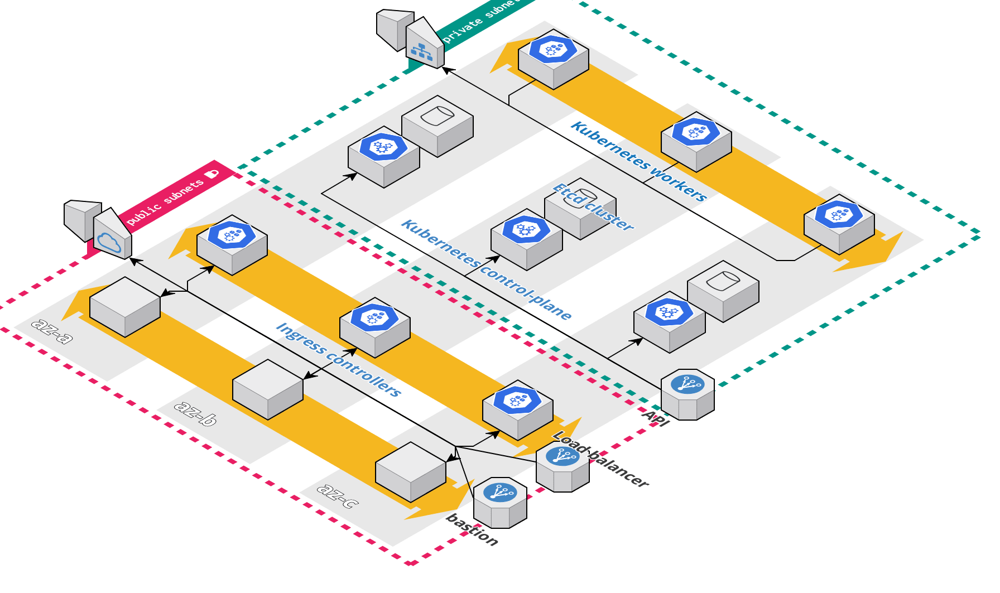

# Terraform Kubernetes

This module deploys a [Kubernetes](https://kubernetes.io/) cluster on AWS using [Kubeadm](https://kubernetes.io/docs/reference/setup-tools/kubeadm/)



## Requirements

* A DNS zone. The [kops documentation](https://github.com/kubernetes/kops/blob/master/docs/getting_started/aws.md#configure-dns) describes in details the way to do so.

## How to use the modules

This repository contains a _**bastion**_ and a _**kubernetes**_ [module](https://github.com/Smana/terraform-kubernetes/tree/main/modules).

```console
$ terraform init
$ terraform apply
```

When you apply this configuration you'll get a local **kubeconfig** in the root terraform directory.

```console
$ export KUBECONFIG=$(terraform output -json | jq -r '.kubeconfig.value')
```

From now on you can use the newly created Kubernetes cluster from your local machine (`kubectl`, `helm`)

```console
$ kubectl get nodes
NAME                                       STATUS     ROLES                  AGE     VERSION
ip-10-0-1-129.eu-west-3.compute.internal   NotReady   control-plane,master   2m31s   v1.20.1
ip-10-0-2-55.eu-west-3.compute.internal    NotReady   <none>                 58s     v1.20.1
```

## Post-apply actions

### CNI Plugin

* The cluster has been provision without `kube-proxy`. Indeed it is meant to be used with **Cilium**.
* I tried to use the Helm provider but I'm not sure this is actually useful as I want to use a GitOps tool for apps deployment. Currently, I decided to run the Helm command using the CLI for the CNI plugin.
* **Warning** about the pod CIDR, it must be different from the subnets you use within your VPC

Here is an example of a Helm command that installs Cilium with kube-proxy replacement.

```console
$ helm repo add cilium https://helm.cilium.io/
"cilium" has been added to your repositories

$ helm upgrade --install cilium cilium/cilium --version 1.9.1 --namespace kube-system \
--set kubeProxyReplacement='strict' \
--set k8sServiceHost=$(terraform output -json | jq -r '.api_dns.value'),k8sServicePort='6443' \
--set ipam.operator.clusterPoolIPv4PodCIDR="172.16.0.0/12"

$ watch kubectl get po -n kube-system
```

```console
Every 2.0s: kubectl get po -n kube-system                                                                                                                                                                                                                                                   dm-smana: Sat Jan  9 16:01:58 2021

NAME                                                               READY   STATUS    RESTARTS   AGE
cilium-bmgc7                                                       1/1     Running   0          61s
cilium-operator-66c94d747c-j2nwc                                   1/1     Running   0          61s
cilium-operator-66c94d747c-v9n22                                   1/1     Running   0          61s
cilium-qhdjb                                                       1/1     Running   0          61s
coredns-74ff55c5b-grwk8                                            1/1     Running   0          6m5s
coredns-74ff55c5b-j7n9s                                            1/1     Running   0          6m5s
etcd-ip-10-0-1-169.eu-west-3.compute.internal                      1/1     Running   0          5m59s
kube-apiserver-ip-10-0-1-169.eu-west-3.compute.internal            1/1     Running   0          5m59s
kube-controller-manager-ip-10-0-1-169.eu-west-3.compute.internal   1/1     Running   0          5m59s
kube-scheduler-ip-10-0-1-169.eu-west-3.compute.internal            1/1     Running   0          5m59s
```

### Additional control-planes for high availablity

**Note:** We use here a [external etcd topology](https://kubernetes.io/docs/setup/production-environment/tools/kubeadm/ha-topology/#external-etcd-topology).

Basically, we'll retrieve the command line to run in the second control-plane from the initial control-plane node.

Connect to the first control-plane

```console
$ BASTION=$(terraform output -json | jq -r '.bastion_host.value')
$ CP1=$(terraform output -json | jq -r '.control_plane_ips.value[0]')
$ ssh -J ubuntu@${BASTION} ubuntu@${CP1}
```

From there we'll **retrieve the command line** from the userdata logs

```console

$ tail -n 20 /var/log/cloud-init-output.log | grep -C 2 '\-control-plane'
  kubeadm join api-smana.cloud.smana.me:6443 --token d1meoo.ismcgj64t5mljpud \
    --discovery-token-ca-cert-hash sha256:ad022c5ec37265c8c1c20ad53cb30298d539b25fc3c92a5ca2204fe72a1604f2 \
    --control-plane --certificate-key 755faa13f436577a846f94358d467095d95d09faa4e9219ddda457a3c6861cce

Please note that the certificate-key gives access to cluster sensitive data, keep it secret!
```

Run the **command line** in the **second** control-plane and **append** the `node-name`. The command would looks like

```console
kubeadm join api-smana.cloud.smana.me:6443 --token d1meoo.ismcgj64t5mljpud \
    --discovery-token-ca-cert-hash sha256:ad022c5ec37265c8c1c20ad53cb30298d539b25fc3c92a5ca2204fe72a1604f2 \
    --control-plane --certificate-key 755faa13f436577a846f94358d467095d95d09faa4e9219ddda457a3c6861cce \
    --node-name $(cloud-init query ds.meta_data.hostname)
```

## Roadmap
Note: Opiniated choices that can be challenged

Changes on terraform configs

- [x] External Etcd
- [x] Control plane High availability
- [ ] Deploy the node local DNS architecture (as part of terraform ?)
- [ ] Extract modules into distinct repositories (tls, etcd, bastion, kubernetes)
- [ ] Workers kernel tuning
- [ ] Tune etcd
- [ ] Add a worker pool in the public subnet for loadbalancing
- [ ] Default values with complexe variables (objects) [#7](https://github.com/Smana/terraform-kubernetes/issues/7)

Documentation in order to have a complete setup

- [x] Deploy Cilium as CNI plugin
- [ ] Run end2end test (sonobuoy, CSI bench)
- [ ] Configure Hubble
- [ ] Nginx ingress controller as loadbalancing
- [ ] Add a NLB in front of the Ingress controllers and check how the client IP is forwarded
- [ ] External DNS to automatically provision domain names when an ingress is created
- [ ] Deploy ArgoCD
- [ ] Add cert-manager in order to be able to create certs with Letsencrypt
- [ ] Prometheus operator, Grafana
- [ ] Loki as logging solution
- [ ] Deploy Vault (raft storage, KMS auto unseal) with sidecar injector
- [ ] Configure a demo app to be deployed (GitOps)

## License

This code is released under the Apache 2.0 License. Please see [LICENSE](https://github.com/Smana/terraform-kubernetes/tree/main/LICENSE) for more details.
